# Módulo: Técnicas de Programação I (PY) #
Oferecido por: 
 <i class="fas fa-laptop"></i> 📔 AdaTech e Ifood <i class="fas fa-laptop"></i> 📔

**Professores:**
<i class="fas fa-laptop"></i> 📔 Carlos Stefano Filho & Rudiney Casali <i class="fas fa-laptop"></i> 📔

**Participação**

⭐ O grupo é composto por 6 integrantes, trabalhamos via Git/GitHub e podemos ver a participação conforme a quantidade de commits realizadas no Projeto.

**Grupo 02**  

Composto por:  
⭐César Augusto 
⭐Eduardo Carvalho 
⭐Iago Mansur 
⭐Leonardo Henrrique 
⭐Myrna Martinelli 
⭐Ruan Faria 

⭐⭐⭐⭐⭐⭐⭐⭐⭐⭐⭐⭐⭐⭐⭐⭐⭐⭐⭐⭐⭐⭐⭐⭐⭐⭐⭐⭐⭐⭐⭐⭐⭐⭐

<h3>Projeto Vem Ser Tech 2023 - <DS> Turma 1105<h3>

**Objetivo e Orientações do Projeto**  Realizar uma análise exploratória de dados utilizando um Conjuto de Dados de livre escolha.
Estruture sua análise criando um storytelling: Uma história contada com informações, gráficos, imagens e medidas estatísticas, associando dados a fatos em uma linha do tempo.
Podendo incluir quantas bases considerar necessário e filtrar as informações mais relevantes para sua história.  
  
**Banco de Dados**
  
<a href="https://raw.githubusercontent.com/educarvallho/Vem_Ser_Tech-Dados/main/Projeto-Tecnicas_de_Programacao_I/Clean_Ads_Data.xlsx" class="btn" target="_blank">Link para o Banco de Dados</a>

O Banco de Dados é relacionado a campanhas de Anúncios (Advertising).
Nele está disponível os vários tipos de Ads e as principais métricas.

Variável                | Significado
------------------------| ---------------------------
Timestamp               | Ano - Mês - Dia - Hora/24
Date                    | Ano - Mês - Dia
Hour of Day             | Hora/24
Date.1                  | Dia da semana
InventoryType           | Não catalogado     
 AD Size                | Tamanho em pixeis      
 Ad Type                | Não catalogado     
 Platform               | Plataforma de apresendação do anúncio
 Device Type            | Dispositivo de apresendação do anúncio
 Format                 | Formato do vídeo (Banner ou Vídeo)
 Available_Impressions  | Impressões disponíveis(contratadas)
 Matched_Queries        | Coincidência com chave de pesquisa
 Impressions            | Impressões efetuadas
 Clicks                 | Numero de clicks
 Spend                  | Valor gasto com os anúncios
 Fee                    | Taxas
 Revenue                | Receita 
 CTR                    | Clicks por exibição
 CPM                    | Custo por Mil Impressões
 CPC                    | Custo por click

⭐⭐⭐⭐⭐⭐⭐⭐⭐⭐⭐⭐⭐⭐⭐⭐⭐⭐⭐⭐⭐⭐⭐⭐⭐⭐⭐⭐⭐⭐⭐⭐⭐⭐

**Introdução sobre o Projeto**

Realizamos toda a tratativa dos dados, com vários trechos de códigos relevantes ao aprendizado e entendimento do comportamento dos dados.

**Etapa 1. Pré-Processamento dos Dados**

No pré-processamento foram observadas as seguintes características:
- Apenas a coluna "AD Size" tem um valor nulo em comparação com as outras;
- Temos 25857 observações não nulas;
- Os tipos das variáveis são condizentes com o que representam.
- 75% ou mais das taxas gira em torno tem o valor de 0.35
- Temos alguns valores zerados
- 25% dos dados apresentam um CPC de 0.4999 que é mais de 4 vezes o valor que separa 50% dos dados. O que ocorre nesses casos e como evitar?

**2. Identificação e Tratamento de Outliers**

Na etapa de tratamento dos Outliers foram observadas as seguintes características:
- Todos as colunas numéricas contam com uma grande quantidade de outliers;
- Avaliando os gráficos, embora os outliers estejam destacados parecem fazer sentido, já que muitos estão apenas relacionados com as escolhas feitas pela equipe responsável pelas propagandas (ao gastar mais, é natural aumentarmos o valor de várias outras colunas);
- CTR parece uma concentração de valores com apenas alguns outliers;
- A maior parte das distribuições das variáveis quantitativas se aproxima de uma destribuição uniforme;
- Os outliers parecem ter um padrão e também parecem estar em destribuição uniforme, porém em quantidades menores é menos visível;

**Etapa 3. Perguntas de Negócio**

Abaixo foram respondidas algumas perguntas importantes:

- Qual plataforma teve mais impressões?

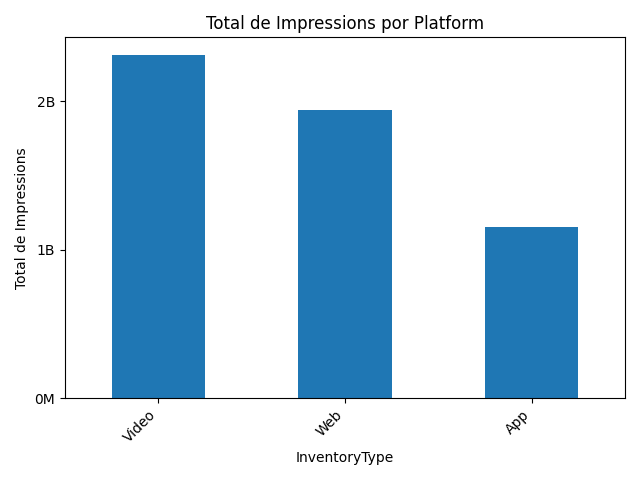
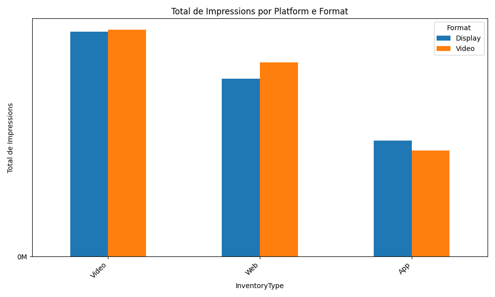

Acima podemos observar:
1. Plataforma de vídeo é a com maior quantidade de impressões
2. Video é o formato preferido nas plataformas Video e Web, enquanto Display se sobressai no 

- Qual formato teve maior quantidade de clicks?

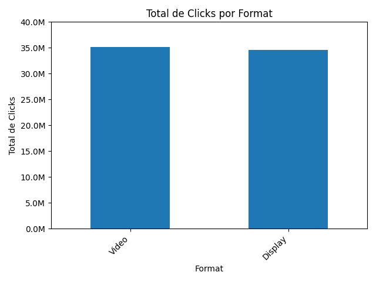
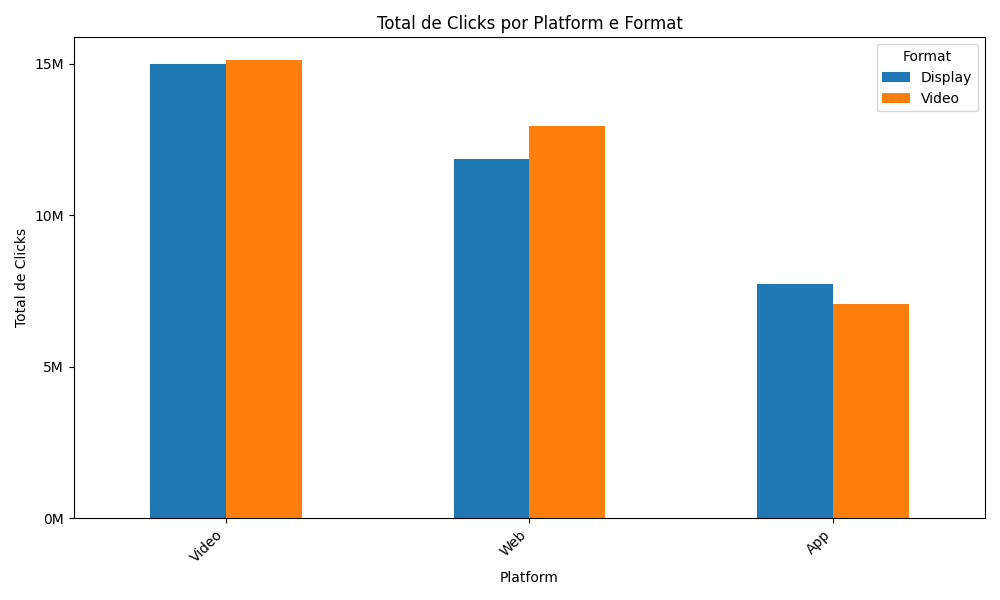

Acima podemos observar:
1. Vídeo é a melhor plataforma tanto relação formato vídeo quanto o formato display, mas a frente iremos investigar se isto também ocorre em relação ao CPC;
2. App é a única plataforma que display é melhor que vídeo;

- Qual a melhor plataforma em relação ao CPC?

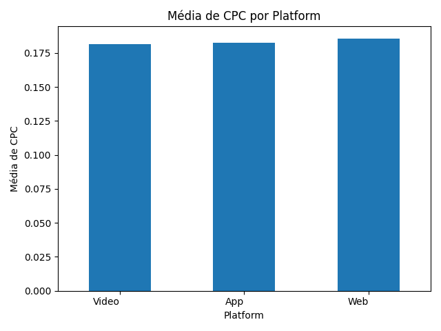

Acima podemos observar:
1. Apesar do vídeo apresentar impressões e clicks superiores, o custo por click é muito próximo entre as plataformas

- Qual o melhor formato em relação ao CPC?

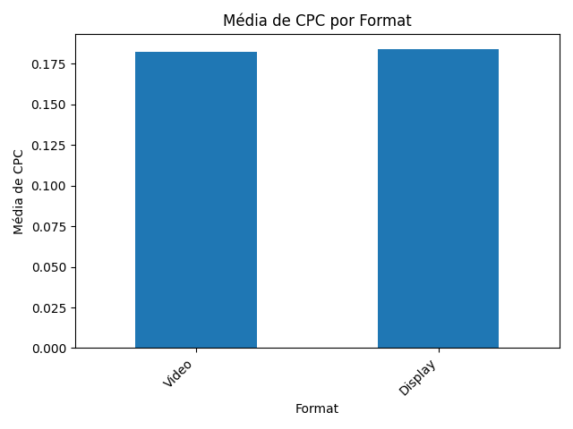

Acima podemos observar:
1. Não há diferenças significativas com relação ao formato

- Qual o melhor dia da semana em relação ao CPC?

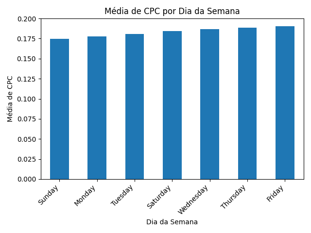

Acima podemos observar:
1. Podemos notar que sexta-feira é o melhor dia para anúncios

- Qual o melhor horário em relação ao CPC?

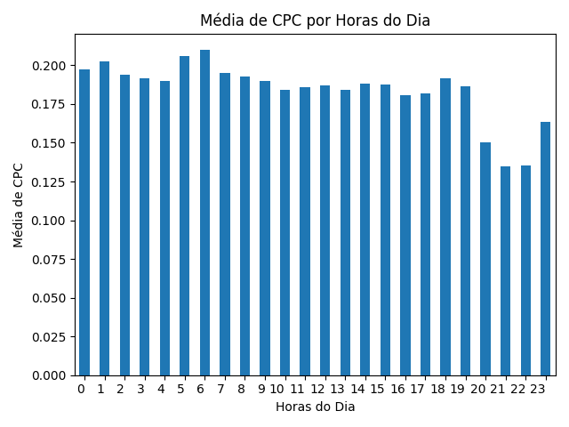

Acima podemos observar:
1. O horário com maior CPC custuma ser entre 6 e 7 da manhã
2. Podemos observar uma queda no CPC entre 20:00 e 22:00

- Qual foi a variação do custo por Click?

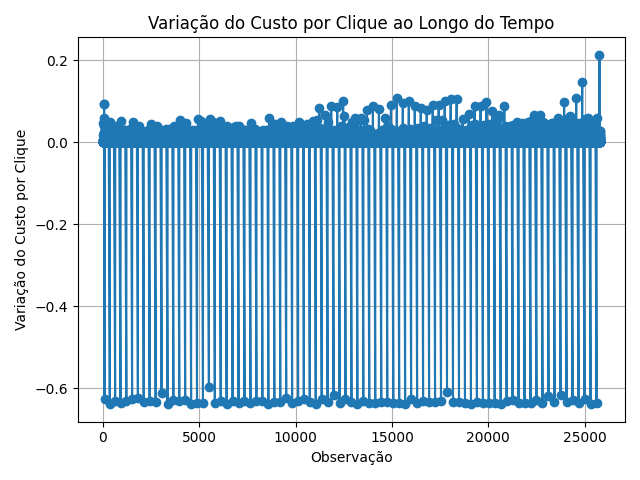

Acima podemos observar:
1. Um acúmulo de variação inferiores a 10 % com saltos para -60%
2. Pode apontar um movimento cíclico

- Qual horário tem maior disponibilidade e menor custo?

1. Horário com maior disponibilidade: 21
2. Horário com menor custo: 23

- Qual melhor horário em relação ao CPC/clicks?

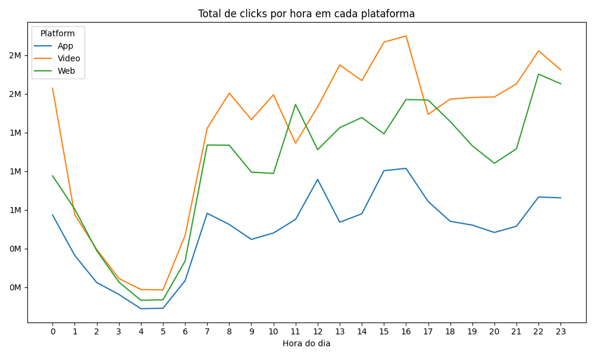
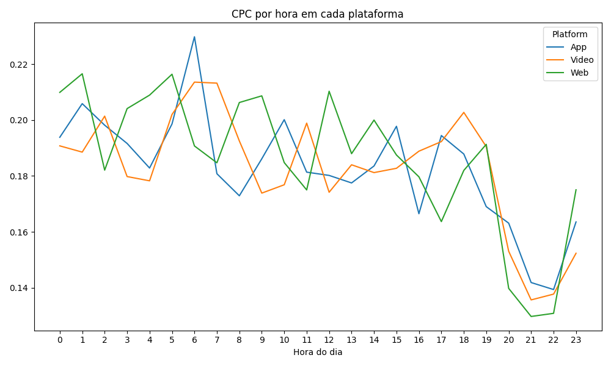

Acima podemos observar:
1.  Os melhores horários giram em torno de 20:00 e 22:00

- Qual o melhor dia da semana em relação aos Clicks?

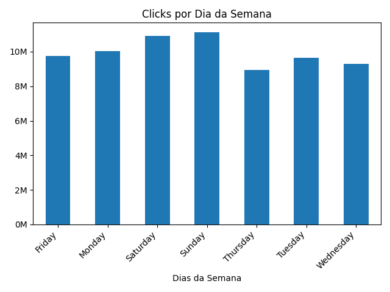

Acima podemos observar:
1. O melhor dia da semana para se ter mais clicks é o domingo

⭐⭐⭐⭐⭐⭐⭐⭐⭐⭐⭐⭐⭐⭐⭐⭐⭐⭐⭐⭐⭐⭐⭐⭐⭐⭐⭐⭐⭐⭐⭐⭐⭐⭐

## Como Usar

Para utilizar este projeto, siga estes passos:

1. Clone o repositório em seu ambiente local.
2. Certifique-se de ter Python instalado.
3. Execute os arquivos Python correspondentes a cada funcionalidade para interagir com o sistema.

## Requisitos

- Python 3.x

## Contribuições e Feedback

Contribuições são bem-vindas! Se encontrar erros ou tiver sugestões para melhorar o projeto, fique à vontade para criar issues ou enviar pull requests.

## Licença

Este projeto é licenciado sob a Licença MIT - veja o arquivo [LICENSE](LICENSE) para mais detalhes.
